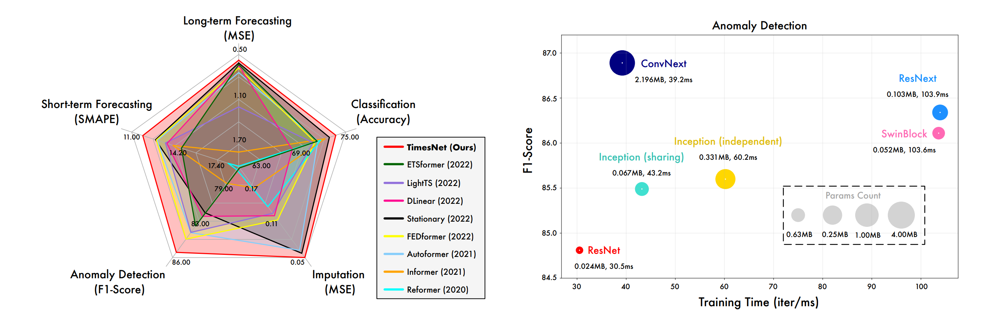
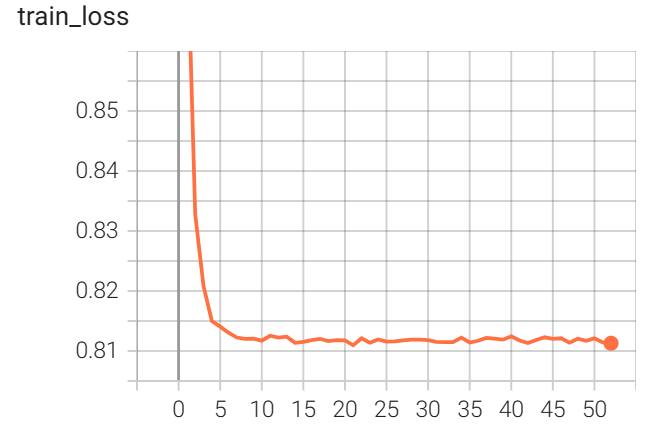

# TimesNet: Temporal 2D-Variation Modeling for General Time Series Analysis
论文地址：https://arxiv.org/abs/2210.02186

源代码地址：https://github.com/thuml/TimesNet

### 论文结果

**在长时、短时预测、缺失值填补、异常检测、分类五大任务上实现了全面领先**

### 论文解读

[ICLR2023 | TimesNet: 时序基础模型，预测、填补、分类等五大任务领先 - 知乎 (zhihu.com)](https://zhuanlan.zhihu.com/p/606575441)

### 代码修改

1、修改了 `ren.py` 文件，可以通过读入 `yaml` 文件来进行调参，同时支持命令行传参，需要注意的是，通过命令行传入的参数具有更高的优先级，可以更改自己的 `yaml` 文件路径，修改地点在 `ren.py` 中，修改 `cfg_path` 变量即可

2、在 `./exp/exp_long_term_forecasting.py` 中，加入了 `tensorboard` ，用来记录训练时损失函数的变化，保存路径为 `./logs/train/` ，可以通过 `tensorboard` 来查看相关损失函数的图像

3、修改了 `./utils/tools.py` 中的保存 `tes` 结果的相关代码，将之前保存结果的 `pdf` 文件格式改为 `png` 格式

4、关于运行代码，在写好你自己的 `yaml` 文件后，直接运行 `run.py` 即可
### 例子

损失函数

预测结果

long_term_forecast_test_TimesNet_custom_ftM_sl96_ll48_pl96_dm32_nh8_el2_dl1_df32_fc3_ebtimeF_dtTrue_test_0  
mse:1.3909492492675781, mae:0.7284500598907471

### 一些问题

1、关于 requirements.txt ：如果没有gpu可以安装cpu版本的torch

2、数据集格式要注意，原代码的数据集下载链接为：https://cloud.tsinghua.edu.cn/f/84fbc752d0e94980a610/